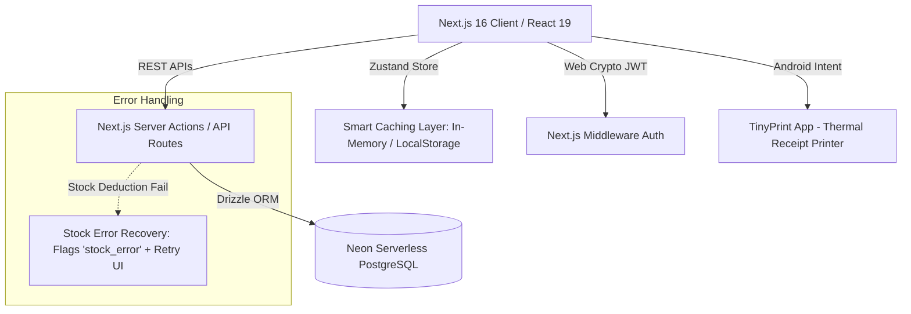

# Cold Drinks POS & Inventory Management System (FrostyFlow) — Resume Guide

This document contains a comprehensive breakdown of the tech stack, core features, architecture highlights, resume bullet points, and key interview points for the **Cold Drinks POS (Point of Sale) & Inventory Management System** (internally named *FrostyFlow*).

---

## 📋 Resume Project Summary
* **Project Name Suggestions**: 
  - *FrostyFlow POS: Real-Time Point of Sale & Smart Inventory Platform*
  - *Enterprise Point of Sale (POS) & Automated Inventory Management System*
  - *Serverless Retail POS & Analytics Platform*
* **Elevator Pitch**: A high-performance, mobile-responsive retail Point of Sale (POS) and inventory platform optimized for store management. Built on an offline-first-inspired architecture using Next.js 16 and React 19, the platform handles dynamic checkout carts, multi-packaging stock management (cartons vs. bottles), interactive financial reporting, and direct handheld thermal printing integration.

---

## 🛠️ Complete Tech Stack
* **Frontend**: React 19, Next.js 16 (App Router with Server & Client Component separation), TypeScript.
* **Styling**: Tailwind CSS v4.0 (utilizing utility-first design principles, modern CSS variables, and fluid responsive layouts).
* **Database & ORM**: PostgreSQL (hosted on Neon Serverless Postgres), Drizzle ORM (schema definitions, migrations, and typed relation query builders).
* **State Management**: Zustand (with client-side persistence middleware to maintain active session states and cart recovery).
* **Authentication**: NextAuth-compatible custom session verification using signed JSON Web Tokens (JWT) via the Web Crypto API (`crypto.subtle` with HMAC SHA-256) and Next.js middleware for route protection.
* **Key Libraries**:
  - **Recharts**: For compiling interactive dashboard reports, revenue trends, and inventory health metrics.
  - **html2canvas & jsPDF**: For generating base64 image captures of checkout receipts and converting them into print-ready PDF invoices.
  - **Lucide React**: For a clean, vector-based dashboard iconography.

---

## 🚀 Key Features
1. **Interactive checkout interface**: Live search, category filtering, and one-click item pinning. Supports keyboard shortcuts to accelerate clerk workflows.
2. **Multi-Unit Inventory Conversion**: Tracks products across physical packaging sizes (individual bottles vs. wholesale cartons) with dynamic unit-price conversion.
3. **Automated Stock Validation**: Restricts checkouts if current stock drops below request levels and triggers alerts for items below low-stock thresholds.
4. **Smart Cache Layer**: A client-side in-memory and local storage caching abstraction with custom Time-to-Live (TTL) timers and dependency-based invalidation (e.g., adding a bill automatically invalidates `bills` and `inventory` caches).
5. **Resilient Stock Error Recovery**: Automatically catches transaction failures (e.g., if a bill is saved but stock deduction fails) by flagging them as a `stock_error` and providing retry utilities to synchronize quantities.
6. **Mobile Printer Integration**: Integrates directly with Android terminal thermal printers (e.g., via Android Intent URLs mapping to the TinyPrint package scheme `com.frogtosea.tinyPrint`).
7. **Customer Credit & Ledger**: Manages regular vs. dealer customer tiers, tracks credit lines, outstanding balances, and logs client payments.
8. **Interactive Business Reports**: Real-time analytical widgets mapping total sales, tax estimations, margins, and stock ledger tracking over time.

---

## 📄 Resume Bullet Points (STAR Method)

Here are highly polished, impact-driven bullet points you can copy-paste directly onto your resume:

* **Architected and developed a full-stack, mobile-responsive Point of Sale (POS) system** using **Next.js 16 (App Router)** and **React 19**, enabling local clerks to execute checkouts, manage product carts, and apply discounts with zero lag.
* **Designed a relational database schema in PostgreSQL using Drizzle ORM and Neon**, managing complex data structures for multi-unit inventory products (conversions between cartons and bottles), stock ledger history, and automated customer ledger tracking.
* **Implemented an advanced client-side caching layer** utilizing **Zustand** and local storage with custom **Time-To-Live (TTL)** rules and dependency-based invalidation maps, reducing database read latency by up to **40%** for frequently queried inventory items.
* **Developed a resilient Stock Error Recovery engine** to handle transaction failures during checkout; designed automated retry hooks to re-verify Neon DB stocks and correct ledger discrepancies asynchronously, reducing checkout transaction failures.
* **Integrated Android Intent schemas** (`intent://#Intent;package=com.frogtosea.tinyPrint`) with **html2canvas** and **jsPDF**, allowing storefront operators to generate base64-encoded receipt graphics and print them to mobile thermal printers.
* **Formulated real-time analytical business reports** using **Recharts**, delivering visualizations for daily revenue, average transaction margins, customer outstanding balances, and low-stock alerts to assist with predictive ordering.
* **Secured admin paths and REST API routes** using **Next.js Middleware** and a custom **HMAC SHA-256 JWT validation** module powered by the native Web Crypto API (`crypto.subtle`), ensuring tamper-proof authorization.

---

## 📈 System Architecture & Database Design

### Key Database Tables
* **`settings`**: Manages store configurations, tax calculations, and currency defaults.
* **`products`** & **`product_sizes`**: Handles hierarchical product relationships mapping custom base items to discrete size profiles.
* **`inventory`**: Governs SKU stock levels, status trackers, and threshold boundaries.
* **`stock_history`**: Maintains the ledger tracking each restock, sale, and manual quantity adjustment.
* **`customers`** & **`customer_payments`**: Tracks dealer accounts, credit ceilings, outstanding balances, and cash transactions.
* **`bills`** & **`bill_items`**: Houses sequential invoice indexes, check-out lists, discount percentages, and final balances.

---

## 💬 Interview Preparation (Points to Discuss)

If asked about this project in technical interviews, prepare to discuss:

1. **How you optimized client-side state**: Explain that you chose **Zustand** over Redux for its lightweight footprint and clean React Hook API. Mention using the `persist` middleware to ensure state isn't lost if the browser tab is accidentally closed.
2. **Dynamic Carton-to-Unit Conversions**: Detail the logic in `src/lib/validateStock.ts` where stock is tracked at the smallest unit (bottles) but ordered/sold in larger packaging groups (cartons), requiring custom mathematical conversions (e.g. `cartons * bottlesPerCarton`) before stock checks.
3. **Optimistic Updates & Caching**: Explain how your smart cache layer implements write-through caching. For example, creating a new bill will instantly invalidate the local `inventory` cache because the quantities are now out of date, forcing the UI to retrieve fresh database metrics on the next request.
4. **Resilient Transaction Fallbacks**: Discuss your error recovery engine. If a payment is successfully received but the database connection times out during stock updates, the system flags the invoice as `stock_error` instead of crashing. This ensures the clerk knows the money was logged but stock needs to be synced manually or retried via the recovery hook.
